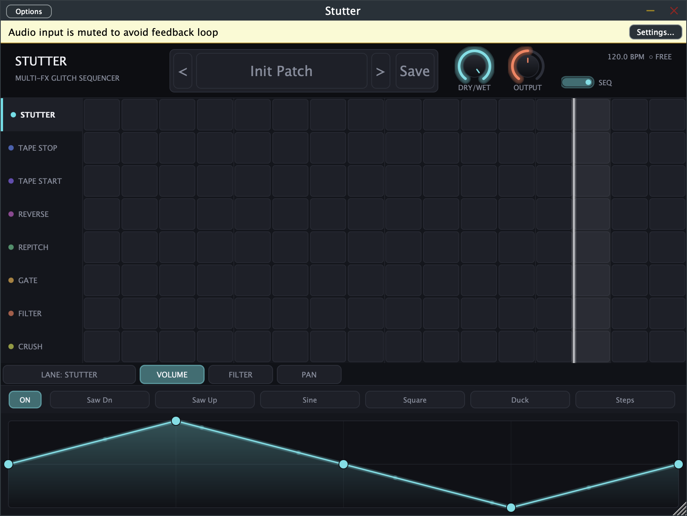

# Stutter

マルチFXグリッチシーケンサープラグイン(VST3 / AU / Standalone、macOS)。
iZotope Stutter Edit 2 / Cableguys ShaperBox 3 / Xfer LFO Tool / Illformed Glitch 2 / Sugar Bytes Effectrix 2 にインスパイアされた「いいとこ取り」設計。

> **macOS 専用**です。Windows / Linux はビルド定義上も対象外で、サポートしていません。



## 機能

- **8レーン × 16ステップのエフェクトシーケンサー**(ホストテンポ同期、停止時は内部クロック)
  - Stutter(レート/ループ長減衰/ピッチスライド)、Tape Stop、Tape Start、Reverse、Repitch、Gate、Filter(SVF+LFO)、Crush
  - Buffer系レーンは排他、Texture系レーンは重ねがけ可能。切替は等パワークロスフェードでクリックレス
- **描画可能なカーブモジュレーター 3系統**(Volume / Filter / Pan)— ブレークポイント+曲率、プリセット形状6種、テンポ同期
- **ファクトリープリセット 29個**(Init + Stutter系6 / Tape系5 / Gate&Sidechain系6 / Glitch系6 / Filter&Texture系5)+ ユーザープリセット(`~/Library/Audio/Presets/Maniax/Stutter/`)
- カスタムダークUI(900×620、比率固定リサイズ、発光プレイヘッド、ドラッグ描画グリッド)

## ビルド

```sh
cmake -B build -DCMAKE_BUILD_TYPE=Release
cmake --build build -j8
```

JUCE 8.0.8 は CMake FetchContent で自動取得。ビルド後、VST3/AU は `~/Library/Audio/Plug-Ins/` に自動コピーされる。

### ユニバーサルビルド(arm64 + x86_64)

デフォルトのローカルビルドはホストアーキテクチャ(Apple Silicon Mac では arm64 のみ)になる。
Intel Mac でも動くユニバーサルバイナリを作る場合は `CMAKE_OSX_ARCHITECTURES` を指定する(CI もこの設定でビルドしている):

```sh
cmake -B build -DCMAKE_BUILD_TYPE=Release -DCMAKE_OSX_ARCHITECTURES="arm64;x86_64"
cmake --build build -j8
```

## 検証

- `pluginval --strictness-level 8` パス(VST3)
- AU: `auval -v aufx Stt1 Manx`

## ドキュメント

仕様・State構造は [SPEC.md](docs/SPEC.md) を参照。

## License

Stutter is licensed under the **GNU Affero General Public License v3.0 (AGPL-3.0)**. See [LICENSE](LICENSE) for the full text.

This project uses [JUCE 8](https://juce.com/), which is available under the AGPLv3 for open-source projects (or under a commercial JUCE license for closed-source use). Distributing Stutter under AGPL-3.0 satisfies JUCE's open-source licensing terms. If you hold a commercial JUCE license, you may relicense your own build/fork accordingly — this repository's default license is AGPL-3.0 unless you choose otherwise for your own distribution.
