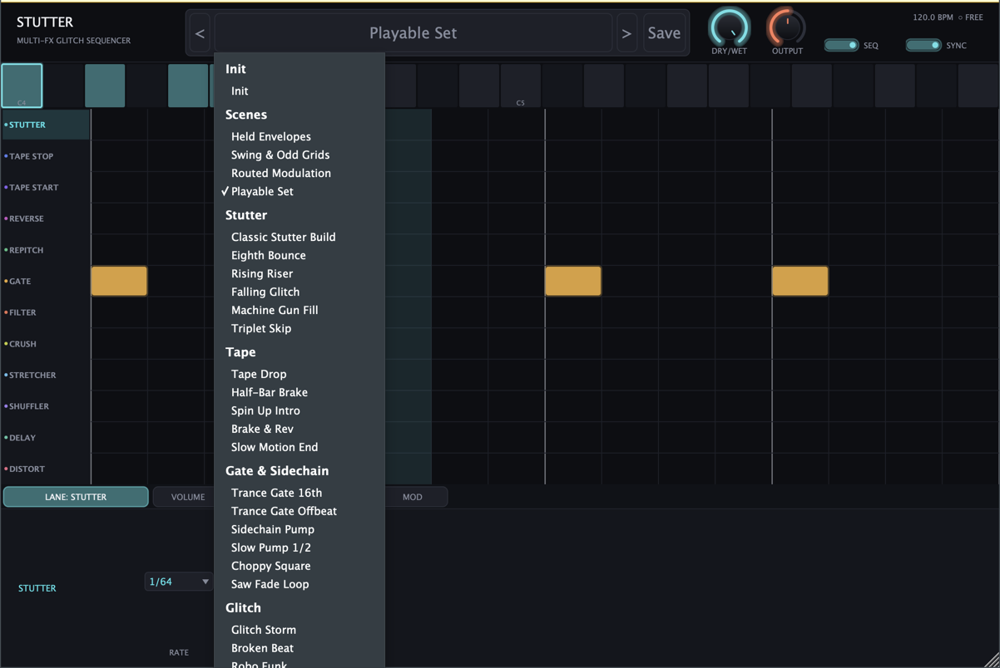
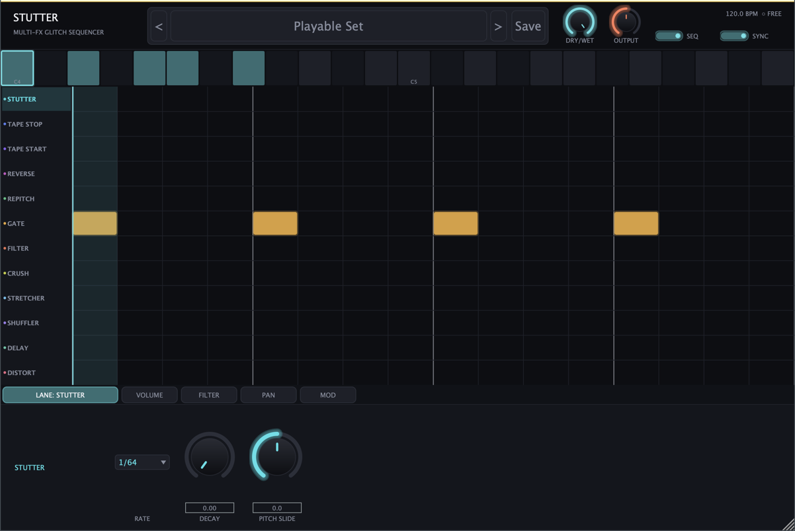
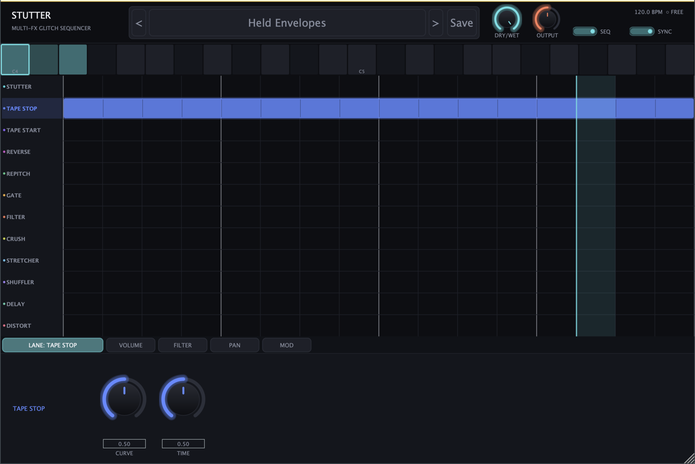
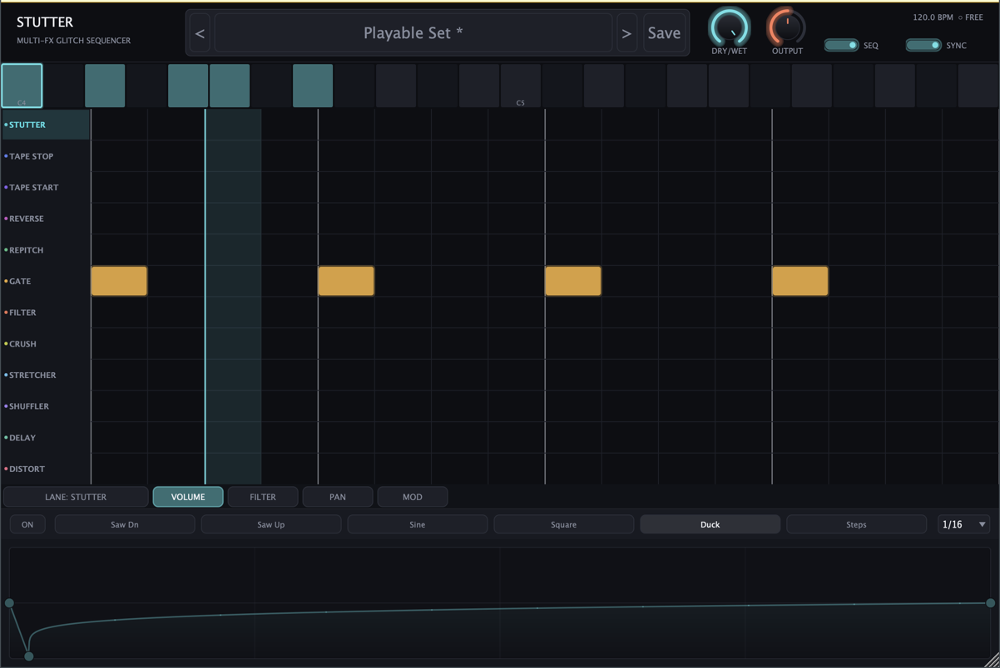
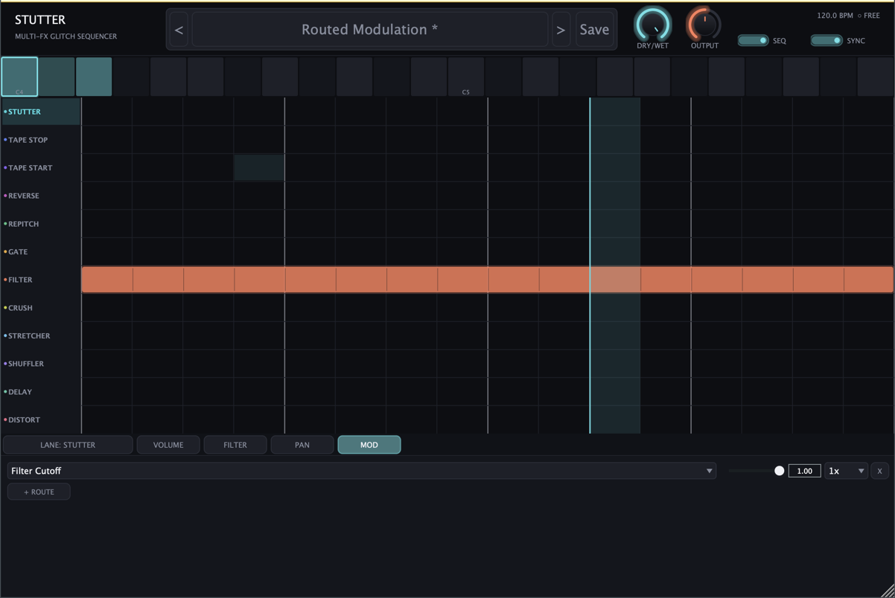

# Stutter ユーザーマニュアル

音を刻む、止める、飛ばす、壊す。Stutter は12種類のエフェクトを小節の上に「置いて」
使う、グリッチ・エフェクトプラグインです。

macOS 専用。VST3 / AU / スタンドアロンで動作します。

---

## 目次

1. [インストール](#インストール)
2. [5分で音を出す](#5分で音を出す)
3. [画面の見かた](#画面の見かた)
4. [ブロックを描く](#ブロックを描く)
5. [シーンとMIDI演奏](#シーンとmidi演奏)
6. [エフェクト12種](#エフェクト12種)
7. [カーブで動かす](#カーブで動かす)
8. [プリセット](#プリセット)
9. [困ったときは](#困ったときは)

---

## インストール

ビルドすると、以下の3つが作られます。

| 形式 | 置き場所 |
|---|---|
| VST3 | `~/Library/Audio/Plug-Ins/VST3/Stutter.vst3` |
| Audio Unit | `~/Library/Audio/Plug-Ins/Components/Stutter.component` |
| スタンドアロン | 単体アプリ。DAW なしで試せます |

DAW を起動し直すとプラグインリストに現れます。Logic の場合は初回だけ検証が走ります。

---

## 5分で音を出す

**Stutter は「かける」より「置く」プラグインです。** つまみを回す前に、まず出来合いの
プリセットを鳴らしてみるのが近道です。

### 手順

1. ループ素材(ドラムループが分かりやすい)のトラックに Stutter を挿します
2. 再生します。この時点では音は変わりません
3. 画面上部の名前が書かれた欄をクリックします



4. **Scenes** の中から `Playable Set` を選びます
5. 音が刻まれ始めます

これで完了です。画面中央のマス目に色のついた四角が並び、上を光の線が左から右へ走って
いるはずです。**その四角が「ここでエフェクトをかける」という指示**で、光の線が現在の
再生位置です。

### 次にやること

`Playable Set` は **鍵盤で切り替えて使う** ように作られたプリセットです。
MIDI キーボードを繋いで **C4(真ん中のド)から G4** までを弾いてみてください。
音の刻まれかたが鍵盤ごとに変わります。

MIDI キーボードがなければ、画面上部の鍵盤の絵を直接クリックしても同じことができます。

---

## 画面の見かた



上から順に4つの区画に分かれています。

### ① ヘッダー(いちばん上)

| 表示 | 意味 |
|---|---|
| `<` `名前` `>` | プリセットの選択。矢印で前後に送れます |
| `Save` | 現在の状態に名前を付けて保存 |
| `DRY/WET` | 原音とエフェクト音の混ぜ具合。左に回すほど原音だけ |
| `OUTPUT` | 出力音量 |
| `SEQ` | エフェクトの ON / OFF。切ると原音がそのまま出ます |
| `SYNC` | DAW のテンポに合わせるかどうか |
| `120.0 BPM` | 現在のテンポ |

プリセット名の右に `*` が付いていたら「保存していない変更がある」という意味です。

### ② シーンストリップ(鍵盤の絵)



鍵盤ひとつひとつが「シーン」です。**色が付いている鍵盤には中身が入っています。**
白枠が付いているのが今編集している鍵盤です。

クリックするとその鍵盤に切り替わり、同時に音も切り替わります。

### ③ ブロックグリッド(まんなかの広いマス目)

左端に12個のエフェクト名が縦に並んでいます。これが **レーン** です。
横方向は時間で、1小節分が表示されています。

色付きの四角が **ブロック** です。ブロックが置かれている区間だけ、そのレーンの
エフェクトがかかります。

太い縦線は拍の区切り、細い線はその中の刻みです。光って動いている縦線が再生位置です。

### ④ 下部タブ

| タブ | 中身 |
|---|---|
| `LANE: ○○` | 選んでいるレーンのつまみ |
| `VOLUME` `FILTER` `PAN` | 音量・フィルター・定位を絵で描いて動かす |
| `MOD` | カーブを好きなつまみに繋ぐ設定 |

レーン名(左端)をクリックすると、そのレーンが選ばれてタブの中身が変わります。

---

## ブロックを描く

ブロックの操作はすべてマウスだけで完結します。修飾キーは要りません。

| やりたいこと | 操作 |
|---|---|
| 置く | 何もない所を**ドラッグ**。伸ばした分だけの長さになります |
| 動かす | ブロックの**まんなかをドラッグ** |
| 長さを変える | ブロックの**左端か右端をドラッグ** |
| 消す | ブロックを**右クリック** |
| まとめて消す | **右ドラッグ**でなぞる |

置いた瞬間から音に反映されます。ひとつのドラッグは「1回の操作」として扱われるので、
`⌘Z` で元に戻せます。

### 長さが音を変えます

**これが Stutter でいちばん大事な考えかたです。**

たとえば `TAPE STOP`(テープの停止音)を1マスだけ置くと、減速が始まった途端に次の
マスが来て、ほとんど何も起きません。同じブロックを**1小節まるごとに伸ばす**と、
1小節かけてゆっくり停止する、あの効果になります。

`Held Envelopes` プリセットがこれを実演しています。TAPE STOP のブロックが横一杯に
伸びているのが見えるはずです。

短く置く効果と長く置く効果は、**同じエフェクトでもまったく別物**だと考えてください。

---

## シーンとMIDI演奏

### シーンとは

**シーンは、画面まるごとの記憶です。** ブロックの配置も、全部のつまみも、カーブも、
ぜんぶまとめて1つのシーンに入っています。

シーンは鍵盤の数だけ(128個)持てます。**MIDI ノートを弾くと、その音程に対応する
シーンに切り替わります。**

つまり Stutter は、エフェクトを楽器のように演奏できます。サビの入りで C4、
ブレイクで E4、といった使いかたです。

### 演奏のしかた

1. `Playable Set` など、Scenes カテゴリのプリセットを読み込みます
2. 色の付いた鍵盤が、中身の入っているシーンです
3. MIDI キーボードでその音程を弾くと切り替わります

鍵盤の絵をクリックしても同じです。MIDI キーボードがなくても試せます。

切り替えは**音を切らずに**行われます。演奏中に切り替えてもプツッというノイズは
出ません。

### 空の鍵盤を弾いたら

何も起きません。中身のないシーンに切り替わって無音になる、ということはないので、
安心して弾き回して構いません。

---

## エフェクト12種

上から順に並んでいます。同じ列(縦方向)に複数のブロックを置くと、重ねがけになります。

### 音を切り貼りするもの

| レーン | 何が起きるか |
|---|---|
| **STUTTER** | 短く切り取って繰り返す。いちばん基本のグリッチ |
| **TAPE STOP** | テープが止まるように減速する。**長く置くほど効きます** |
| **TAPE START** | 逆に、止まった状態から再生速度まで加速する |
| **REVERSE** | 逆再生する |
| **REPITCH** | 音程を変える |
| **STRETCHER** | 引き伸ばす。細かい粒に分けて散らします |
| **SHUFFLER** | 細切れにして順番を入れ替える。確率で動くので毎回少し違います |

### 音色を変えるもの

| レーン | 何が起きるか |
|---|---|
| **GATE** | 音を細かく途切れさせる。トランスゲート |
| **FILTER** | 高域や低域を削る |
| **CRUSH** | ビットを荒くして汚す。ローファイ化 |
| **DISTORT** | 歪ませる。4種類の歪みかたを選べます |
| **DELAY** | やまびこ。他と違い、原音とは別系統で返ってきます |

### つまみの見かた


レーン名をクリックすると、下の `LANE:` タブにそのレーンのつまみが出ます。
つまみの下の数字は直接入力もできます。

上の画面は TAPE STOP を選んだところで、`CURVE`(減速のかかりかた)と
`TIME`(減速にかける時間)の2つがあります。

---

## カーブで動かす

`VOLUME` `FILTER` `PAN` の3つのタブでは、**線を描いて**音量・音色・定位を
時間変化させられます。



上の例は `Duck` を押したところです。頭で音量がガクッと落ちて戻ってくる、
サイドチェイン風のポンプ効果になります。

### 操作

| やりたいこと | 操作 |
|---|---|
| 形を選ぶ | `Saw Dn` `Saw Up` `Sine` `Square` `Duck` `Steps` のボタン |
| 点を動かす | 点を**ドラッグ** |
| 点を足す | 線の何もない所を**ダブルクリック** |
| 点を消す | 点を**ダブルクリック**(両端は消せません) |
| 線をふくらませる | 線の上で**右ドラッグ**(上下で曲がりかたが変わる) |
| 繰り返す速さ | 右端のメニュー(`1/16` など) |
| ON / OFF | 左端の `ON` ボタン |

### MOD タブ ― カーブを他のつまみに繋ぐ



`VOLUME` `FILTER` `PAN` は決まった行き先に繋がっていますが、**MOD タブを使うと
どのレーンのどのつまみでもカーブで動かせます。**

`+ ROUTE` を押すと1行増えます。

| 欄 | 意味 |
|---|---|
| 左のメニュー | 動かしたいつまみ(例: `Filter Cutoff`) |
| スライダーと数値 | どれくらい動かすか(0〜1) |
| `1x` | カーブが1小節に何周するか |
| `X` | この行を削除 |

上の画面は `Routed Modulation` プリセットで、フィルターのカットオフをカーブで
動かしている状態です。

---

## プリセット

### 種類

| カテゴリ | 中身 |
|---|---|
| **Init** | まっさら。ここから作り始めます |
| **Scenes** | 鍵盤で切り替えて演奏する、複数シーン入りのセット(4種) |
| その他 | 1画面ぶんの単体プリセット(28種) |

**Scenes カテゴリの4つ**は、それぞれ違う特徴を見せるために作られています。

| 名前 | 何を見せているか |
|---|---|
| `Held Envelopes` | 長いブロックで TAPE STOP がきちんと停止しきる例 |
| `Swing & Odd Grids` | 3連や5拍子など、変わった刻みかた |
| `Routed Modulation` | カーブでつまみを動かす例 |
| `Playable Set` | C4〜G4 に効きの強さ順で配置した演奏用 |

### 保存

`Save` を押して名前を付けると保存されます。保存先はここです。

```
~/Library/Audio/Presets/Maniax/Stutter/
```

書き出されるのは XML ファイルなので、他の人に渡すこともできます。

---

## 困ったときは

### 音が変わらない

- `SEQ` が OFF になっていませんか(ヘッダー右側)
- `DRY/WET` が左に振り切れていませんか
- **ブロックがひとつも置かれていないシーンを見ていませんか。** 鍵盤の絵で色の付いた
  ものを選んでください
- 再生していますか。Stutter は DAW の再生位置に合わせて動きます

### プツプツ、パチパチいう

エフェクトの切り替わり自体にノイズは出ない設計です。以下を確認してください。

- `CRUSH` や `DISTORT` を強くかけていませんか。これらは**意図的に歪ませる**ものです
- `OUTPUT` を上げすぎて音が割れていませんか

### 短いブロックで TAPE STOP が効かない

仕様です。[ブロックを描く](#長さが音を変えます)を参照してください。ブロックを
長くしてください。

### 鍵盤を弾いても切り替わらない

- DAW のトラックが Stutter に MIDI を送る設定になっていますか
- 弾いている音程に中身がありますか(鍵盤の絵で色が付いているか)

### 同じ設定なのに毎回少し違う音になる

`SHUFFLER` と `STRETCHER` は確率で動くレーンです。ただし**同じ小節では毎回同じ結果**に
なるよう作られているので、書き出した音と聴いていた音が食い違うことはありません。

---

## 現在の制限

正直に書いておきます。

- **v1(1.1.2)で保存したプロジェクトの設定は読み込めません。** 開くと初期状態に
  なります。v1 のプリセット28種は v2 用に作り直して同梱してあります
- **MIDI の演奏モードは1種類だけです。** ノートを押している間だけ効かせる「MIDIモード」、
  ノートを離したあとの挙動を選ぶ「リリースモード」、鍵盤でシーンを切り替えず音だけ
  出す「シーンロック」は、内部的には動きますが**操作する画面がまだありません**。
  現状はノートを弾くとシーンが切り替わる動作に固定されています
- **オーバーサンプリングは行っていません。** `CRUSH` `DISTORT` `REPITCH` を高い設定に
  すると、ざらついた倍音が乗ります。グリッチ用途としては味になりますが、
  きれいな音程変化を求める用途には向きません
- **DAW のプログラム切り替え機能には未対応です。** プリセットは Stutter 自身の
  ブラウザから選んでください
